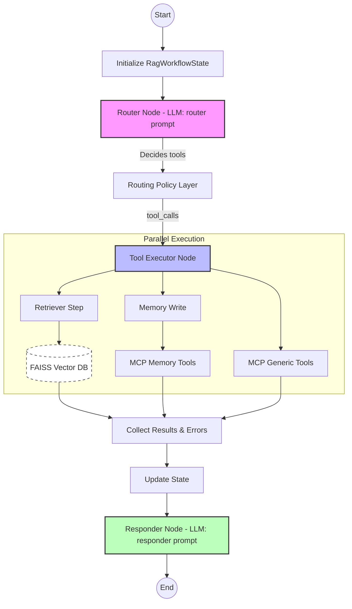

# Agent LangGraph Architecture

This diagram represents the current implementation of the RAG and Tool Orchestration workflow in `app/infrastructure/rag_workflow.py`.

```mermaid
flowchart TD
    %% Entry Point
    Start((Start)) --> Init[Initialize RagWorkflowState]
    Init --> RouterNode[Router Node - LLM: router prompt]

    %% Routing Decision
    RouterNode -- "Decides tools" --> Policy[Routing Policy Layer]
    Policy -- "tool_calls" --> ExecutorNode[Tool Executor Node]

    %% Parallel Tool Execution
    subgraph Execution_Context [Parallel Execution]
        direction TB
        ExecutorNode --> RetR[Retriever Step]
        RetR --> FAISS[(FAISS Vector DB)]
        
        ExecutorNode --> MemW[Memory Write]
        MemW --> MCP_M[MCP Memory Tools]
        
        ExecutorNode --> MCP_G[MCP Generic Tools]
    end

    %% Result Collection
    FAISS --> Collector[Collect Results & Errors]
    MCP_M --> Collector
    MCP_G --> Collector

    %% Final Synthesis
    Collector --> StateUpdate[Update State]
    StateUpdate --> ResponderNode[Responder Node - LLM: responder prompt]
    ResponderNode --> End((End))

    %% Styling
    style RouterNode fill:#f9f,stroke:#333,stroke-width:2px
    style ExecutorNode fill:#bbf,stroke:#333,stroke-width:2px
    style ResponderNode fill:#bfb,stroke:#333,stroke-width:2px
    style FAISS fill:#fff,stroke:#333,stroke-dasharray: 5 5
```
